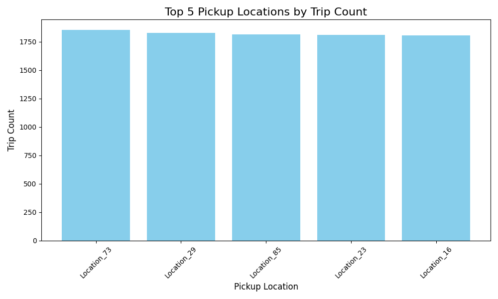

# Scalable Analysis of NYC Taxi Trips Using PySpark

This project demonstrates the use of PySpark to process and analyze a large-scale dataset of synthetic NYC taxi trip data. It showcases how to leverage distributed computing for efficient big data processing, cleaning, transformation, and analysis, along with visualizing key insights.

## Features

- **Data Cleaning**: Removes missing values to ensure data quality.
- **Data Transformation**: Computes trip durations and prepares the data for analysis.
- **Exploratory Analysis**:
  - Calculates the total number of trips and average trip durations.
  - Identifies the top 5 pickup locations by trip count.
  - Extracts details of the longest trip.
- **Visualization**: Generates bar charts to visualize the most popular pickup locations.
- **Exporting Results**: Saves the processed dataset and visualizations for further use.

## Technologies Used

- **PySpark**: For scalable data processing and transformations.
- **Pandas**: For additional data handling and analysis.
- **Matplotlib**: For creating visualizations.

## Dataset

The dataset contains 1,000,000 rows and the following columns:
- `pickup_datetime`: Timestamp of trip start.
- `dropoff_datetime`: Timestamp of trip end.
- `pickup_location_id`: ID of the trip's pickup location.
- `dropoff_location_id`: ID of the trip's dropoff location.
- `passenger_count`: Number of passengers.
- `trip_distance`: Distance of the trip (miles).
- `fare_amount`: Fare amount ($).

## Results

1. **Total Trips**: Displays the number of trips in the dataset.
2. **Average Trip Duration**: Provides the mean duration of all trips in minutes.
3. **Top Pickup Locations**: Highlights the 5 most frequented pickup locations.
4. **Longest Trip**: Details the trip with the maximum duration.

## Outputs

- Processed dataset: Saved as a CSV file.
- Visualization: A bar chart showing the top 5 pickup locations, saved as an image.

## Visualizations

## Author

[Abinesh S](https://github.com/Abinesh-Data-Analyst)

---

Feel free to contribute or suggest improvements to this project!

